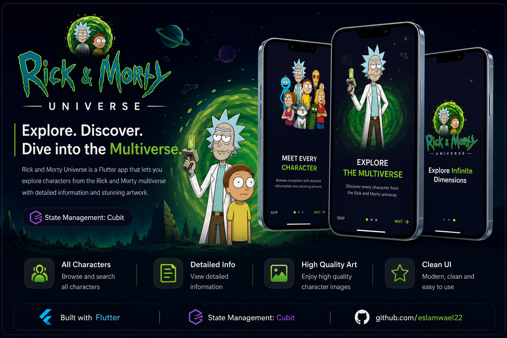

<div align="center">

# 🛸 Rick & Morty Universe

Explore the Rick & Morty multiverse with a beautiful Flutter application that lets you browse characters, search instantly, and view detailed information about every character.




</div>

---

# ✨ Features

- 🎭 Browse all Rick & Morty characters
- 🔍 Search characters instantly
- 📖 Character Details Screen
- 🖼 High Quality Character Images
- ⚡ Fast & Responsive UI
- 📱 Adaptive Layout
- 💜 Clean Architecture
- 🧩 Cubit State Management
- 🌐 REST API Integration
- 🚀 Smooth Navigation

---

# 🛠 Tech Stack

- Flutter
- Dart
- Cubit
- Dio
- REST API
- Clean Architecture
- Dependency Injection
- Cached Network Image

---

# 📦 Packages

```yaml
flutter_bloc
dio
get_it
go_router
flutter_screenutil
```

---

# 🚀 Getting Started

```bash
flutter pub get
```

```bash
flutter run
```

---

# 🌍 API

The application uses the **Rick & Morty API**

https://rickandmortyapi.com/

---

# 👨‍💻 Developed By

**Eslam Wael**

Flutter Developer

GitHub:
https://github.com/eslamwael22

LinkedIn:
https://linkedin.com/in/eslamwael22

---

<div align="center">

### ⭐ Don't forget to Star the repository if you like it!


</div>
